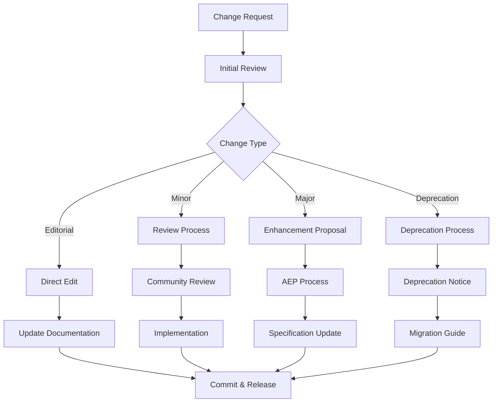

# Change Tracking and Version Management

**Version**: 1.0.0  
**Status**: Stable  
**Last Updated**: 2025-07-11

## Overview

This specification defines how changes to the A5C agent system specifications are tracked, versioned, and managed. It establishes processes for maintaining specification integrity, documenting changes, and coordinating updates across the ecosystem.

## Change Management Process

### Change Categories

1. **Editorial Changes**: Typos, formatting, clarifications
2. **Minor Changes**: Small improvements, examples, non-breaking additions
3. **Major Changes**: Breaking changes, significant new features
4. **Deprecations**: Removal of existing features or APIs

### Change Workflow



## Versioning Strategy

### Semantic Versioning

Specifications follow semantic versioning (semver) principles:

- **Major Version (X.0.0)**: Breaking changes, incompatible API changes
- **Minor Version (X.Y.0)**: New features, backward-compatible additions
- **Patch Version (X.Y.Z)**: Bug fixes, editorial changes

### Version Matrix

| Component | Current Version | Status | Last Updated |
|-----------|----------------|---------|--------------|
| Agent Configuration Format | 1.0.0 | Stable | 2025-07-11 |
| Agent Activation Methods | 1.0.0 | Stable | 2025-07-11 |
| Agent Communication | 1.0.0 | Stable | 2025-07-11 |
| MCP Server Integration | 1.0.0 | Stable | 2025-07-11 |
| System Architecture | 1.0.0 | Stable | 2025-07-11 |
| Enhancement Proposals | 0.1.0 | Draft | 2025-07-11 |

## Change Documentation

### Change Log Format

Each specification maintains a change log following the [Keep a Changelog](https://keepachangelog.com/) format:

```markdown
# Changelog

All notable changes to this specification will be documented in this file.

The format is based on [Keep a Changelog](https://keepachangelog.com/en/1.0.0/),
and this project adheres to [Semantic Versioning](https://semver.org/spec/v2.0.0.html).

## [Unreleased]

### Added
- New feature descriptions

### Changed
- Changes to existing features

### Deprecated
- Soon-to-be removed features

### Removed
- Now removed features

### Fixed
- Bug fixes

### Security
- Security improvements

## [1.0.0] - 2025-07-11

### Added
- Initial stable release
- Complete specification documentation
```

### Change Record Template

```yaml
# Change Record Template
change_id: "CHANGE-001"
title: "Add support for conditional inheritance"
type: "minor"
specification: "Agent Configuration Format"
version: "1.1.0"
date: "2025-07-11"
author: "developer-agent"
description: |
  Add support for conditional inheritance patterns in agent configurations.
  This allows agents to inherit from different base configurations based on
  runtime conditions.
breaking_changes: false
migration_required: false
related_issues:
  - "https://github.com/a5c-ai/action/issues/123"
related_aeps:
  - "AEP-001: Agent Inheritance v2"
```

## Deprecation Process

### Deprecation Timeline

1. **Announcement**: Feature marked as deprecated
2. **Deprecation Period**: Minimum 6 months notice
3. **Migration Support**: Tools and guides provided
4. **Final Warning**: 30 days before removal
5. **Removal**: Feature removed in next major version

### Deprecation Notice Format

```yaml
# Deprecation Notice
feature: "legacy_inheritance_format"
deprecated_version: "1.2.0"
removal_version: "2.0.0"
announcement_date: "2025-07-11"
removal_date: "2026-01-11"
reason: "Replaced by dynamic inheritance system"
migration_guide: "docs/migration/inheritance-v1-to-v2.md"
alternatives:
  - "Dynamic inheritance system"
  - "Template composition"
```

## Compatibility Management

### Backward Compatibility

#### Compatibility Matrix

| Version | Compatible With | Notes |
|---------|----------------|-------|
| 1.0.x | All 1.x versions | Full compatibility |
| 1.1.x | 1.0.x+ | Additive changes only |
| 1.2.x | 1.0.x+ | New features, deprecated warnings |
| 2.0.x | 1.2.x+ | Breaking changes, migration required |

#### Compatibility Guarantees

1. **Patch Versions**: No breaking changes, only fixes
2. **Minor Versions**: Additive changes, full backward compatibility
3. **Major Versions**: May include breaking changes

### Forward Compatibility

#### Design Principles

1. **Extensible Schemas**: Design schemas to accommodate future additions
2. **Optional Fields**: Make new fields optional when possible
3. **Graceful Degradation**: Handle unknown fields gracefully
4. **Version Negotiation**: Support version detection and negotiation

## Migration Management

### Migration Guide Template

```markdown
# Migration Guide: [From Version] to [To Version]

## Overview
Brief description of changes and migration requirements.

## Breaking Changes
List of breaking changes and their impact.

## Migration Steps

### Step 1: Backup Configuration
```bash
# Backup current configuration
cp -r .a5c .a5c.backup
```

### Step 2: Update Agent Files
```bash
# Update agent configurations
./migration-tool --from=1.0 --to=2.0 --path=.a5c/agents/
```

### Step 3: Validate Changes
```bash
# Validate migrated configuration
a5c validate --config=.a5c/config.yml
```

## Automated Migration

Migration tools are provided for automated conversion:

```bash
# Install migration tool
npm install -g @a5c/migration-tool

# Run migration
a5c-migrate --from=1.0 --to=2.0 --path=.a5c/
```

## Testing Migration

Test your migrated configuration:

```bash
# Test configuration
a5c test --config=.a5c/config.yml --dry-run
```
```

### Migration Tool Support

```javascript
// Migration tool interface
class MigrationTool {
  constructor(fromVersion, toVersion) {
    this.fromVersion = fromVersion;
    this.toVersion = toVersion;
  }
  
  async migrate(configPath) {
    // Backup original configuration
    await this.backup(configPath);
    
    // Apply migration transforms
    const config = await this.loadConfig(configPath);
    const migratedConfig = await this.transform(config);
    
    // Validate migrated configuration
    await this.validate(migratedConfig);
    
    // Save migrated configuration
    await this.saveConfig(configPath, migratedConfig);
    
    return migratedConfig;
  }
}
```

## Release Management

### Release Process

1. **Pre-Release**: Development and testing
2. **Release Candidate**: Community testing
3. **Release**: Final release with documentation
4. **Post-Release**: Monitoring and hotfixes

### Release Artifacts

#### Release Package Contents

```
release-package/
├── CHANGELOG.md
├── MIGRATION.md
├── specifications/
│   ├── agent-config-format.md
│   ├── agent-activation-methods.md
│   ├── agent-communication.md
│   ├── mcp-server-integration.md
│   └── system-architecture.md
├── examples/
│   ├── basic-agent.md
│   ├── security-agent.md
│   └── advanced-configs/
├── tools/
│   ├── migration-tool/
│   ├── validation-tool/
│   └── testing-suite/
└── schemas/
    ├── agent-config.json
    ├── system-config.json
    └── validation-rules.json
```

#### Release Notes Template

```markdown
# A5C Agent System v1.1.0 Release Notes

## Release Date
2025-07-11

## Overview
This release introduces conditional inheritance, enhanced MCP server integration, and improved performance optimizations.

## New Features

### Conditional Inheritance
- Support for runtime-based inheritance decisions
- Dynamic template resolution
- Multi-source template composition

### Enhanced MCP Integration
- Improved error handling and retry logic
- Connection pooling for better performance
- New built-in MCP servers

## Improvements
- 40% performance improvement in agent loading
- Enhanced error messages and debugging
- Better memory management

## Bug Fixes
- Fixed template substitution edge cases
- Resolved GitHub API rate limiting issues
- Improved cross-platform compatibility

## Breaking Changes
None in this release.

## Migration Guide
No migration required for this release.

## Known Issues
- Template caching may require clearing in some edge cases
- GitHub Enterprise Server compatibility pending validation

## Installation
```bash
# Update to latest version
npm install -g @a5c/cli@latest
```

## Documentation
- [Complete Changelog](CHANGELOG.md)
- [Migration Guide](MIGRATION.md)
- [Updated Specifications](specifications/)
```

## Quality Assurance

### Review Process

#### Specification Review

1. **Technical Review**: Technical accuracy and completeness
2. **Editorial Review**: Language, formatting, and clarity
3. **Compatibility Review**: Backward and forward compatibility
4. **Security Review**: Security implications and best practices

#### Review Checklist

- [ ] Technical accuracy verified
- [ ] Examples tested and validated
- [ ] Backward compatibility maintained
- [ ] Security implications reviewed
- [ ] Performance impact assessed
- [ ] Documentation updated
- [ ] Migration guide provided (if needed)
- [ ] Community feedback incorporated

### Testing Standards

#### Specification Testing

```bash
# Test specification examples
spec-test --spec=agent-config-format.md --examples

# Validate schema compliance
schema-validate --spec=agent-config-format.md --schema=schemas/

# Test backward compatibility
compat-test --from=1.0.0 --to=1.1.0 --spec=agent-config-format.md
```

#### Automated Validation

```yaml
# CI/CD Pipeline for specifications
name: Specification Validation
on: [push, pull_request]

jobs:
  validate:
    runs-on: ubuntu-latest
    steps:
      - uses: actions/checkout@v4
      - name: Validate Specifications
        run: |
          spec-lint docs/specs/
          spec-test docs/specs/
          schema-validate docs/specs/
          example-test docs/specs/
```

## Monitoring and Metrics

### Change Metrics

- **Change Frequency**: Number of changes per month
- **Change Impact**: Percentage of breaking vs. non-breaking changes
- **Migration Success**: Success rate of automated migrations
- **Community Engagement**: Feedback and contribution rates

### Quality Metrics

- **Specification Coverage**: Completeness of documentation
- **Example Accuracy**: Percentage of working examples
- **User Satisfaction**: Community feedback scores
- **Issue Resolution**: Time to resolve specification issues

## Tooling Support

### Development Tools

#### Specification Linter

```bash
# Lint specifications for consistency
spec-lint docs/specs/a5c-agents/

# Check for broken links
link-check docs/specs/a5c-agents/

# Validate examples
example-test docs/specs/a5c-agents/
```

#### Change Management Tools

```bash
# Generate change log
changelog-gen --from=v1.0.0 --to=v1.1.0

# Create migration guide
migration-gen --from=1.0.0 --to=1.1.0 --breaking-changes

# Validate compatibility
compat-check --spec=agent-config-format.md --version=1.1.0
```

## Community Involvement

### Change Proposal Process

1. **Issue Creation**: Community identifies need for change
2. **Discussion**: Community discussion and requirements gathering
3. **Proposal**: Formal enhancement proposal (AEP) created
4. **Review**: Community and maintainer review
5. **Implementation**: Approved changes implemented
6. **Documentation**: Specifications updated

### Feedback Mechanisms

- **GitHub Issues**: Bug reports and feature requests
- **GitHub Discussions**: Community discussions and questions
- **RFC Process**: Formal request for comments on major changes
- **Community Meetings**: Regular community calls for feedback

## Best Practices

### For Specification Authors

1. **Clear Documentation**: Write clear, unambiguous specifications
2. **Comprehensive Examples**: Provide working examples for all features
3. **Backward Compatibility**: Maintain compatibility when possible
4. **Migration Support**: Provide clear migration paths for breaking changes
5. **Community Engagement**: Involve community in major changes

### For Implementers

1. **Version Pinning**: Pin to specific specification versions
2. **Graceful Degradation**: Handle unknown configuration gracefully
3. **Error Handling**: Provide meaningful error messages
4. **Testing**: Test against specification examples
5. **Feedback**: Provide feedback on specification clarity

### For Users

1. **Version Awareness**: Understand specification versions in use
2. **Migration Planning**: Plan for migration when needed
3. **Feedback Participation**: Provide feedback on proposed changes
4. **Documentation**: Document custom extensions and patterns
5. **Community Participation**: Engage with community discussions

## Related Documents

- [Enhancement Proposals](enhancement-proposals/)
- [Specification Governance](specification-governance.md)
- [Contributing Guidelines](contributing.md)
- [Community Guidelines](community-guidelines.md)

---

*This specification is part of the A5C Agent System Documentation*